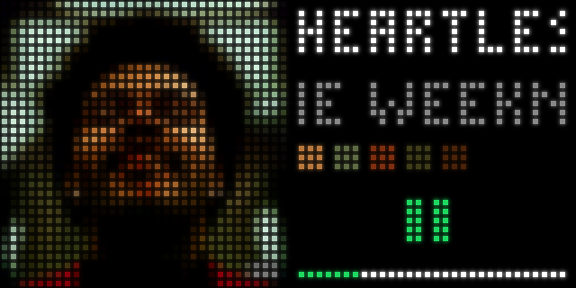
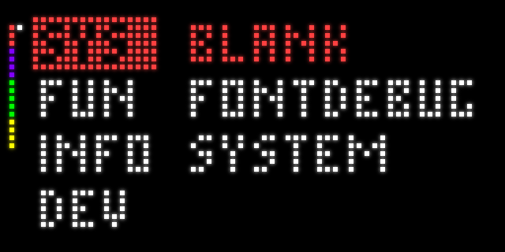
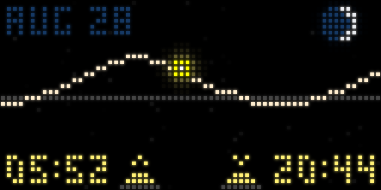
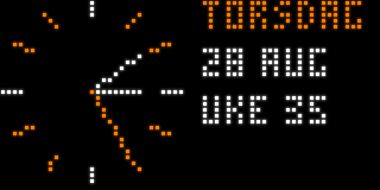
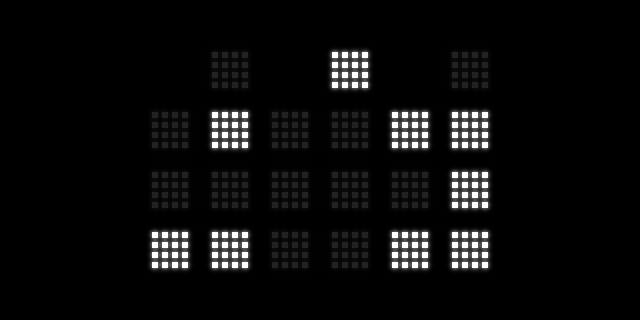
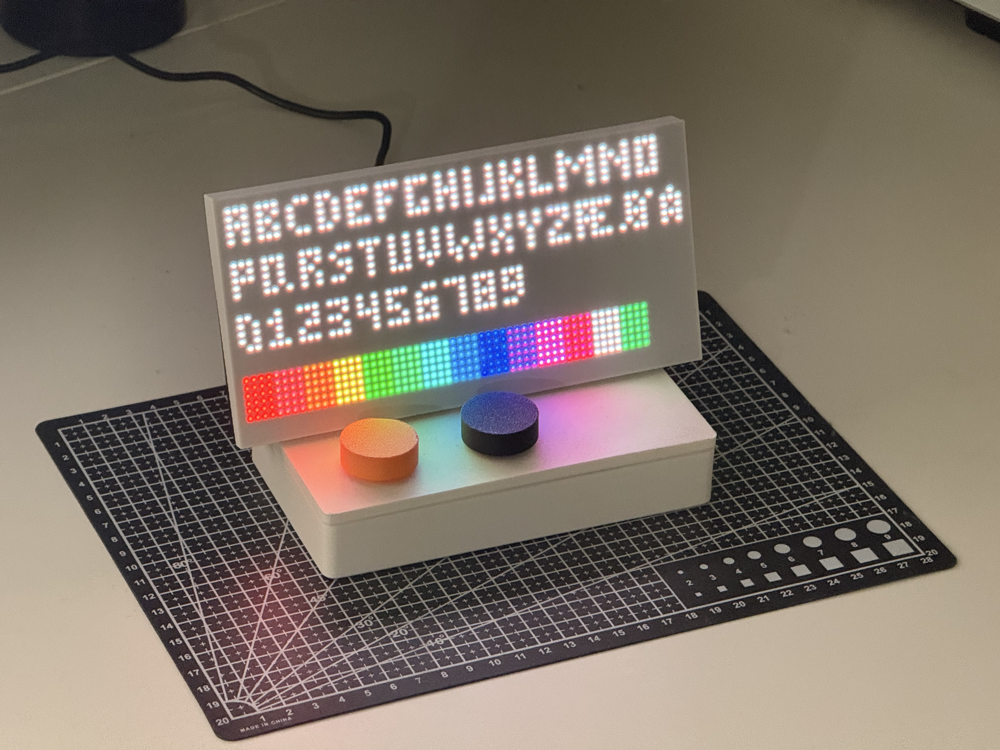

# Matrix LED display - Dashboard

This is a dashboard system used to display information/data using a HUB-75 display and a RPI 5.
I am uing the adafruit Piomatter which offers verry high performance of HUB-75 displays using PIO, which is sadly not compatible with Earlier RPI models.  
Included is also a basic web platform for viewing what is rendered in realtime.

## NOTE!!

This is a hobby project, i have not prioritized code optimizations or cleanness.  
I'm just having fun here : )

## What you need

* A raspberrypi 5 (could probably be ported to an earlier model if you have some experience)
* Rotary encoders (1 Menu and 1 property)
* A matrix LED display (available on ebay, aliexpres, etc. for cheap and from waveshare or genneral hobby-electronics stores (at a greater price))
  * I use a pitch of P3 (mm between pixels) (64px x 32px ~ 200mm x 100mm)
* 3D Printer, or access to one

## Features

* Fully dynamic pannel integration
* Pre made pannels (apps):
  * System (CPU/Temp/RAM)
  * Spotify Integration (Has to be set up with spotify developer credentials and initiated via the Oauth2 flow)
  * Sun-possition screen
  * Weather
  * Different style Clocks
  * ++
* Menu system

## Make your own pannels!
  A template aplication is suplied, the obly thing needed is a function get() that returns a PIL image.  
  The pannel is automatically picked up when in the pannels folder.

## Dependencies

gpiozero flask_socketio flask Pillow numpy (astral psutil, for sky and system pannels)

``` bash
python3 -m pip install flask-socketio pillow numpy astral psutil
```

## Images
Spotify Integration (Kmeans algorithm for extracting dominant colors from image, The text scrolls)  
  

Menu system, ordered into different categories  
  

Sky information  
  

Different Clocks (Norwegian text, can be changed by setting region)  
  
  
  

The actual display (on the Fontdebug pannel pannel)  
  

# In Adafruit Piomatter

the file pins.h must be changed before compilation, to include the pin layout  
I use this one: 
```
struct adafruit_matrix_bonnet_pinout {
    static constexpr pin_t PIN_RGB[] = {2,3,4,17,27,22};
    static constexpr pin_t PIN_ADDR[] = {14,15,18,23,25};
    static constexpr pin_t PIN_OE = 24;   // /OE: output enable when LOW
    static constexpr pin_t PIN_CLK = 10; // SRCLK: clocks on RISING edge
    static constexpr pin_t PIN_LAT = 9; // RCLK: latches on RISING edge
```

RPI Pinouts:  
```
(LVL) 3V  |#   #|  .   (5V)
      R1  |2   #|  .   (5V)
      G1  |3   #|  .   (GND)
      B1  |4  14|  A
(GND)  .  |#  15|  B
      R2  |17 18|  C
      G2  |27  #|  .   (GND)
      B2  |22 23|  D
(LVL) 3V  |#  24|  OE
     CLK  |10  #|  .   (GND)
     LAT  |9  25|  E
```

HUB75 Connector pinout:  

```
 R1   |X X|   G1
 B1   |X #|   GND
 R2   |X X|   G2
 B2  [ X #|   NC
  A  [ X X|   B
  C   |X X|   D
CLK   |X X|   LAT
 OE   |X #|   GND
```